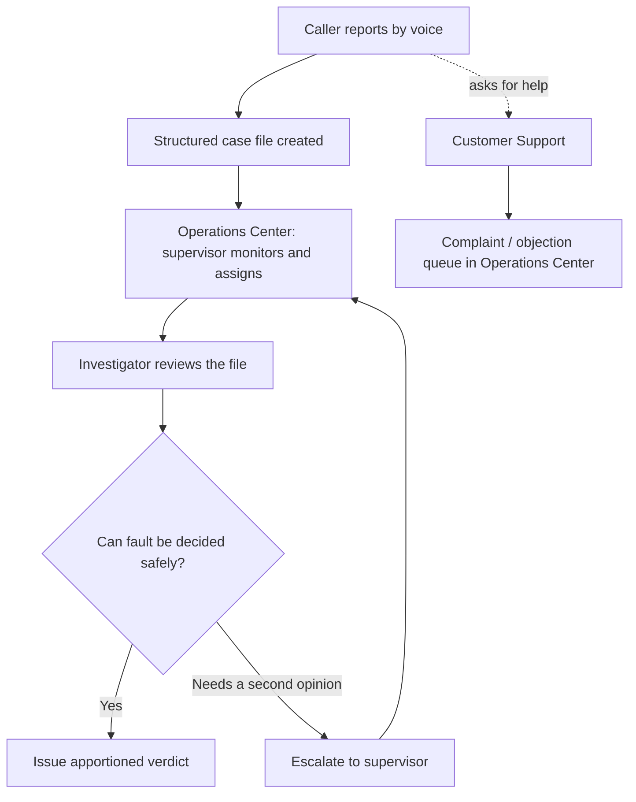
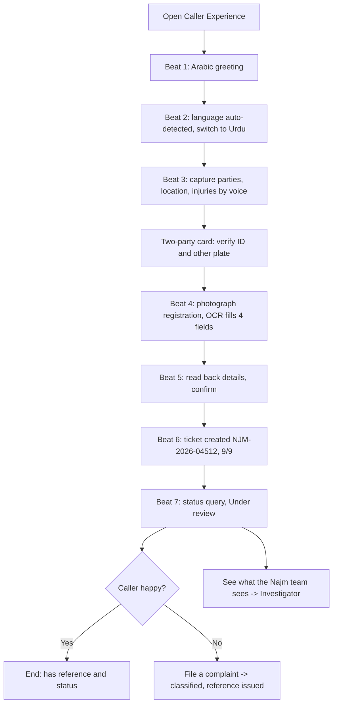
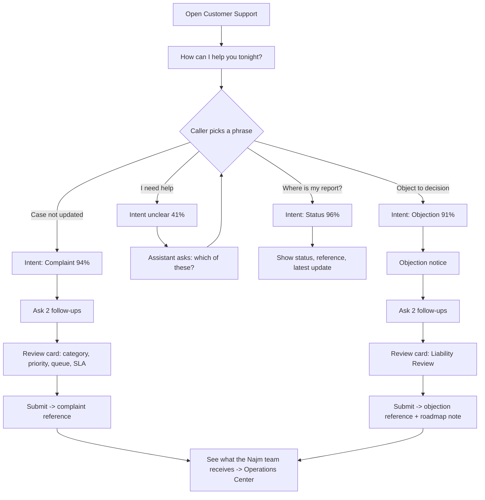
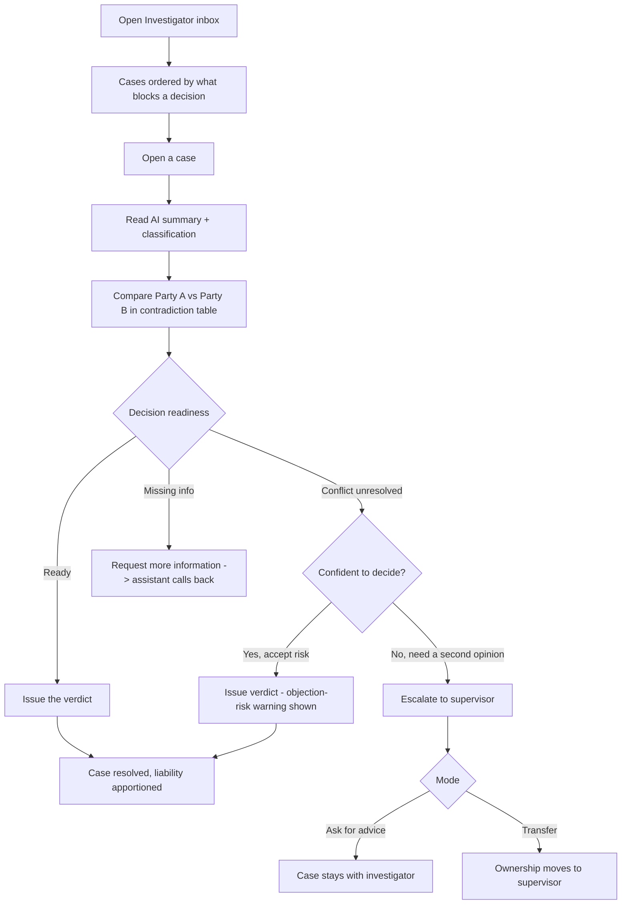
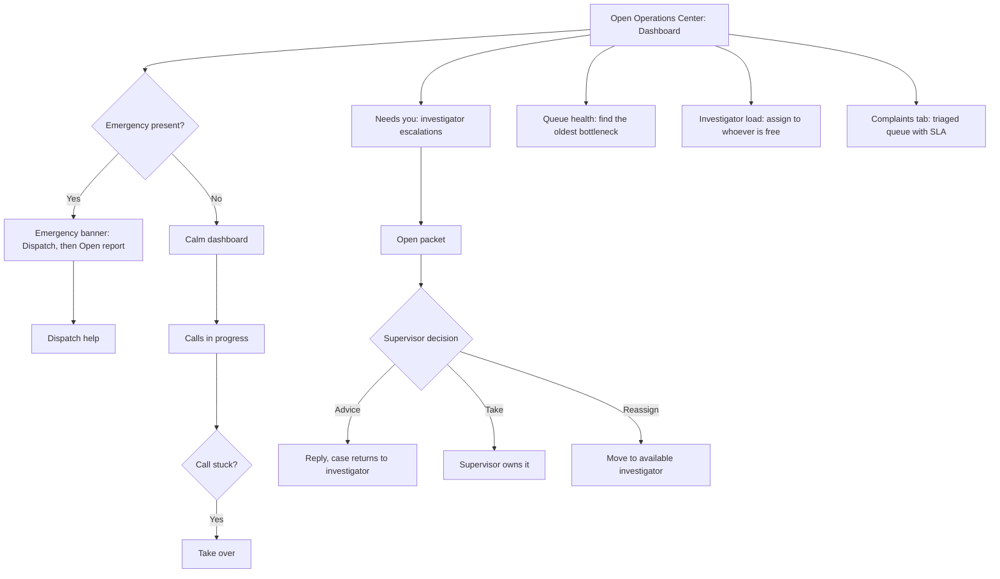
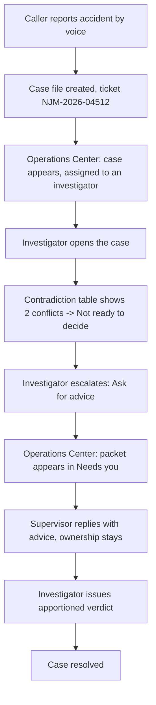
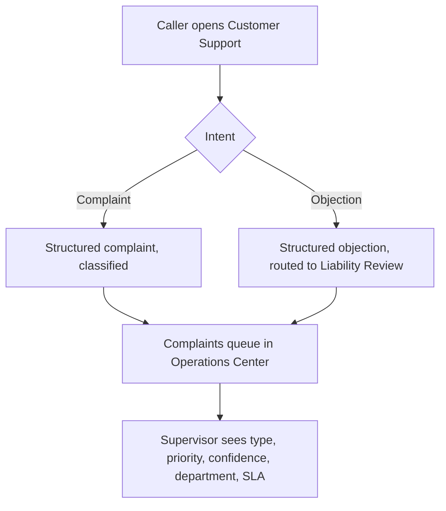

# Najm × Sarj AI — Voice Intake Demo

## User Flows Reference

This document describes every flow that exists in the current demo. It is a
reference for what the product does today, not a proposal for what it could do.

> **What this demo is.** A scripted, clickable simulation built for a live
> sales presentation. There is no backend, no API, no authentication, and no
> live AI model. Every word, field, reference number, and "AI decision" is
> hardcoded in `lib/mockData.ts` and played back on cue. Where this document
> says "the assistant detects" or "the AI classifies," it means the demo
> *shows* that behaviour with pre-written data — it does not compute it.

---

## 1. Product Overview

### What it is

A voice-first conversational intake layer for Najm's accident-reporting and
customer-service operations. A driver reports an accident (or asks for help) by
talking; the assistant collects a structured case file; and Najm's staff work
that file from the other side.

### The four seats

The product is organised as four "seats," each a separate persona with its own
workspace. They are switched from the tab bar at the top of the screen.

| Seat | Route | Persona | Purpose |
|---|---|---|---|
| Caller Experience | `/` | Reporter / Caller (external) | Report an accident by voice and get a trackable ticket |
| Customer Support | `/support` | Reporter / Caller (external) | Ask about status, file a complaint, or raise an objection |
| Investigator | `/investigator` | Investigator (internal) | Review a structured case and decide fault |
| Operations Center | `/ops` | Supervisor (internal) | Run the floor: monitor, triage, assign, handle escalations |

### Language

The app opens in **English** every time (primary language). A toggle in the top
bar switches to **Arabic** for the session; the choice is not saved, so a
reload always returns to English.

One rule governs translation: anything the **assistant wrote** (summaries,
narratives, comparisons) follows the chosen language. Anything a **driver
said** does not — verbatim transcripts stay in the language actually spoken
(for example, Urdu remains Urdu on the English screen), and only the gloss line
beneath switches. A translated transcript is not a verbatim record.

### Colour meaning (used consistently everywhere)

| Colour | Means |
|---|---|
| Najm green | Operational chrome — buttons, statuses, official records |
| Sarj violet | AI-native markers only — language detection, data extraction, the contradiction table, confidence, classification |
| Red | Human safety only — an AI-detected emergency. Nothing else is red. |
| Amber | Human escalation and ageing (a case getting old) |

### Overview flow

---

## 2. Caller Experience

**Route:** `/` &nbsp;•&nbsp; **Persona:** Reporter / Caller (external)

### Role purpose

Let a driver at an accident scene report it by talking, in his own language,
and leave with a tracked reference number — without typing forms.

### Main goals

- Report an accident by voice.
- Confirm identity and the other party by speaking, then verifying on screen.
- Capture evidence (vehicle registration) automatically.
- Receive a case reference and check its status.

### Entry points

- The **Caller Experience** tab (the default screen when the demo opens).

### The screen

One green orb on an empty screen (modelled on a voice-assistant "listening"
view). The orb's animation signals state — gentle breathing when idle, a
stronger pulse when the assistant speaks, a scale-up while the caller speaks.
There is no microphone icon, no waveform, and no chat log. When the assistant
needs something, a single card slides up from the bottom.

The demo is presented as **7 fixed steps ("beats")**. The presenter advances
them manually.

### Navigation

- On-screen **Next** / **Back** buttons and step dots.
- Each request card also has its own button (for example, **Confirm number**,
  **Continue**) that advances the story from inside the phone.
- Keyboard: **Space** = next, **R** = reset, **I** = jump to the Investigator
  seat.

### Step-by-step flow (the 7 beats)

| Beat | Screen | What the caller sees | System response |
|---|---|---|---|
| 1 | Greeting | Orb only. Assistant greets in Arabic. | Listening state. |
| 2 | Language switch | A pill fades in: **"Urdu · auto-detected."** | The assistant detects the caller switched to Urdu and follows. |
| 3 | Guided intake | Orb in "listening" state; then a **two-party card** slides up. | Captures parties, location, injuries by voice. Card shows **Party A** ID number and **Party B** plate, each marked *Verified*, with **Edit** and an optional *Add a photo of the other vehicle*. Button: **Confirm number**. |
| 4 | Documents + OCR | A photo of the vehicle registration, then fields filling in. | The assistant reads 4 fields off the registration (plate, owner, vehicle, insurer), each tagged **From document**. Button: **Continue**. |
| 5 | Confirm details | A read-back card. | Summary of both parties (with one identifier each), location, injuries (**None**), insurance (**Verified**). Button: **Confirm details**. |
| 6 | Report created | A green ticket card. | Reference **NJM-2026-04512**, status **Under review**, **9 / 9 fields complete**. Button: **Continue**. |
| 7 | Status query | A status card at 2:14 AM. | Status **Under review**, next step (assessor within 24h), "Answered instantly." Two extra actions appear (below). |

### User actions and outcomes at beat 7

- **File a complaint** → the caller speaks a complaint; the assistant classifies
  it at submission and returns a complaint reference (**NJM-C-2026-0117**,
  classified *Processing delay · High*). This complaint then appears in the
  Operations Center complaint queue.
- **See what the Najm team sees** → jumps to the Investigator seat, handing the
  same case across the desk.

### Escalation paths

- If an injury were mentioned during intake, the assistant would raise an
  **emergency** (see §5). The main scripted caller journey has **no injuries**,
  so it completes normally. The emergency case is demonstrated separately in
  the Operations Center.

### What is real, mocked, or roadmap

| Element | Status in the demo |
|---|---|
| Voice conversation, language auto-switch (Arabic → Urdu) | Simulated (scripted) — represents a real Sarj platform capability |
| OCR on the registration card | Simulated with hardcoded field values |
| Identity / policy check | Mocked (3 seeded policies, hardcoded ID) |
| Ticket creation and reference number | Mocked (Najm-style ID, no real ticketing system) |

### Important assumptions

- The whole story happens at **2:14 AM** to make the 24/7, no-agent point.
- Numbers, plates, and the registration image are fixed so every run is
  identical.

### Flowchart

---

## 3. Customer Support

**Route:** `/support` &nbsp;•&nbsp; **Persona:** Reporter / Caller (external)

### Role purpose

Show that the same conversational engine also handles Najm's customer service —
not a second product, but the same phone and orb pointed at a different door.
The caller asks naturally; the assistant works out what he needs, asks only
what is missing, and hands the human team a structured request instead of free
text.

### Main goals

- Let the caller open in his own words.
- Detect intent and route to the correct workflow.
- Produce a structured, triaged request for the human team.

### Entry points

- The **Customer Support** tab.

### The screen

Same phone frame and orb as the Caller Experience. Opens with *"How can I help
you tonight?"* and four example phrases the caller can tap.

### Supported intents

The demo demonstrates three supported intents, plus one deliberately ambiguous
opener that makes the assistant ask instead of guess.

| Opening phrase | Detected intent | Shown confidence |
|---|---|---|
| "Where is my accident report?" | Status inquiry | 96% |
| "My case hasn't been updated." | Complaint | 94% |
| "I want to object to the liability decision." | Objection | 91% |
| "I need help." | Not yet clear | 41% → asks a clarifying question |

After a choice, the assistant shows an **Intent detected** chip (violet) with
the confidence figure.

### Flow 1 — Status inquiry

1. Caller picks the status phrase.
2. Assistant confirms intent (Status inquiry, 96%).
3. Returns a status card: **reference NJM-2026-04512**, status **Under review**,
   and the **latest update** with a timestamp.

**Outcome:** the caller has current status without waiting for an agent.

### Flow 2 — Complaint submission

1. Caller picks the complaint phrase (or reaches it via clarify).
2. Assistant asks two short follow-ups: *how long has this been going on* and
   *has anyone from Najm contacted you*.
3. Assistant generates a **review card** before submission: structured summary,
   **Category: Processing delay**, **Priority: High**, **Assigned queue: Claims
   Operations**, **Expected response: 10 working days**.
4. Caller taps **Submit**.

**Outcome:** *Complaint submitted*, reference **NJM-C-2026-0121**, with queue
and SLA. It appears in the Operations Center complaint queue.

### Flow 3 — Objection

1. Caller picks the objection phrase.
2. Assistant recognises this is an objection and shows a notice: *"This request
   will be handled through Najm's objection workflow."*
3. Asks two follow-ups: *what the objection is based on* and *what supporting
   information exists* (dashcam, photos, witness, or nothing).
4. Generates a **review card** routed to **Liability Review**, then **Submit**.

**Outcome:** *Objection recorded*, reference **NJM-O-2026-0042**, with an
explicit note that objection processing is on the roadmap and, for now, enters
the complaint workflow as a structured request.

### User actions

- Tap an opening phrase; answer follow-up questions; **Submit**; **Start over**.
- After any flow: **See what the Najm team receives** → Operations Center.

### System responses

- Intent detection with a confidence figure.
- Follow-up questions (only the gaps — the assistant already "knows" the caller
  and the case).
- A structured review card before anything is submitted.
- A confirmation card with reference, queue, and SLA after submission.

### Escalation paths

- **Objection** is explicitly *not* processed here. It is recorded as a
  structured request and routed to the objection/complaint workflow (roadmap).

### What is real, mocked, or roadmap

| Element | Status |
|---|---|
| Intent detection and confidence | Simulated (each phrase has a pre-set intent and confidence) |
| Status lookup | Mocked (hardcoded case and latest update) |
| Complaint triage (category, priority, queue) | Simulated with an **illustrative taxonomy** — the real taxonomy needs Najm's data (roadmap) |
| Objection processing | **Not built** — roadmap; only captured and routed |

### Important assumptions

- The complaint categories (Processing delay, Assessor conduct, Verdict
  dispute, Service quality) and departments (Claims Operations, Liability
  Review, Field Assessment, Customer Care) are placeholders to be replaced with
  Najm's own.

### Flowchart

---

## 4. Investigator

**Route:** `/investigator` &nbsp;•&nbsp; **Persona:** Investigator (internal)

### Role purpose

Decide fault on a structured case. The assistant only changes what reaches the
investigator's desk; the investigator still makes the decision.

### Main goals

- See what is blocking a decision, at a glance.
- Compare both drivers' accounts before deciding.
- Decide fault, ask for more information, or get help.

### Entry points

- The **Investigator** tab.
- From the Caller Experience: **See what the Najm team sees** (beat 7).
- Keyboard **I** from the Caller Experience.

### Design choice: no dashboard

The investigator lives inside one case at a time, so this seat has no widgets —
just an inbox and a case workspace. Inbox → case. That is the whole structure.

### Main screens

**1. Inbox ("My casework").** The cases assigned to this investigator (Faisal
Al-Harbi), ordered by *what blocks a decision* — not by age. Each row shows the
reference, language, status, a **blockers** summary (for example, "2 unresolved
conflicts," "1 missing field," or "Ready to decide"), and how old it is.

**2. Case workspace.** Three columns, in reading order:

| Column | Contents |
|---|---|
| Decision (leading edge) | Automatic classification tags; AI summary; **Decision readiness**; escalation banner (if any); the four actions; activity log |
| Comparison (centre) | Party A's account and Party B's account side by side; the **Contradiction table**; both verbatim transcripts |
| Evidence (trailing edge) | Extracted fields; evidence list (OCR document, voice-captured plate) |

### The centrepiece: the Contradiction table

The assistant lines up the two drivers' accounts claim by claim and marks each
one **Agree**, **Conflict**, or **One party only**. The investigator's job
stops being "read two transcripts" and becomes "settle the points they
disagree on."

### Decision readiness (replaces "9/9")

A file can be complete on paper and still not safe to decide. The demo case
**NJM-2026-04512 is 9/9 fields complete and still reads "Not ready to
decide"** — because two claims (traffic signal, and Party A's speed) are in
conflict. This is the core point of the whole console: a complete file is not
the same as a decidable one.

### User actions

| Action | What happens | Resulting status |
|---|---|---|
| **Continue investigation** | Logs progress to the timeline. | Under investigation |
| **Request more information** | Choose a party and a topic (drawn from the open conflicts); the assistant "calls the driver back" with a targeted question. | Awaiting information |
| **Escalate to supervisor** | Opens the escalation dialog (see below). | Escalated |
| **Issue the verdict** | Opens the verdict dialog. If a conflict is still open, shows an **objection-risk** warning first. Liability is **apportioned** as Party A's share: **0 / 25 / 50 / 75 / 100%**, with a live split preview. | Resolved |

### Escalation paths (human escalation)

The escalation dialog has **two modes**, because most "help me" requests are a
second opinion, not a handoff:

- **Ask for advice** — the case stays with the investigator.
- **Transfer the case** — ownership moves to the supervisor.

The investigator picks a reason (conflicting accounts, liability unclear,
suspected fraud, complex case) and writes a note (required). The dialog shows a
receipt of everything sent automatically: AI summary, both transcripts, the
contradiction table, documents and OCR, extracted fields, and the activity log.
**The investigator never re-explains the case — the packet is the case.**

### System responses

- Blockers and readiness are computed from the case data (conflicts + missing
  fields + whether the other party's account has arrived).
- Every action writes a timeline entry and updates the case status, which the
  supervisor sees in the Operations Center.

### What is real, mocked, or roadmap

| Element | Status |
|---|---|
| Contradiction table, summary, narratives | Simulated (pre-written comparison data) |
| Readiness calculation | Real logic over the mocked case data |
| "Assistant calls the driver back" | Simulated (status change + timeline entry only) |
| Verdict apportionment | Real UI; recorded to the mocked case, no downstream system |

### Important assumptions

- One investigator seat is shown as "me" (Faisal Al-Harbi). Other investigators
  exist only as names on the roster and as case owners.

### Flowchart

---

## 5. Operations Center

**Route:** `/ops` &nbsp;•&nbsp; **Persona:** Supervisor (internal)

### Role purpose

Run the operations floor. Answer, at a glance: what is on fire, what is
talking, what needs a human, where work is piling up, and who can take it.

### Main goals

- Act on emergencies.
- Monitor live conversations and step in.
- Handle investigator escalations.
- See where the queue is clogged and balance investigator load.
- Review triaged complaints.

### Entry points

- The **Operations Center** tab.
- From the Caller Experience or Customer Support: **See what the Najm team
  sees / receives**.

### Navigation (four tabs)

| Tab | Question it answers |
|---|---|
| **Dashboard** | What is happening right now, and what needs me? |
| **Investigators** | Who is free, who is overloaded, what is unassigned? |
| **Cases** | The full case ledger (every case, searchable at a glance). |
| **Complaints** | The triaged complaint and objection queue. |

### Dashboard widgets

The dashboard shows only things a supervisor acts on. (An earlier version had a
KPI strip; it was removed so the screen leads with action, not metrics.)

1. **Emergency banner** — appears only when an AI emergency exists. Leads with
   **Dispatch**, then **Open report**. This is always the first actionable
   element.
2. **Calls in progress** — live intake cards (language detected, fields captured
   so far, age), each with a **Take over** button.
3. **Needs you** — human escalations from investigators, each showing the
   investigator's initials, the reference, the mode (advice/transfer), the
   reason, the note, and how long it has waited.
4. **Recent activity** — a running feed of what happened across cases.
5. **Queue health** (side panel) — the bottleneck view, shown **by age, not by
   count**: awaiting the other party, ready-but-unassigned, awaiting
   information — each with the oldest waiting case. Turns amber when old.
6. **Investigator load** (side panel) — each investigator with a capacity bar
   and status (Available, Loaded, At capacity, Away) and their oldest case.
7. **Language distribution** (side panel) — Arabic / Urdu / English mix, marked
   "for review only; work is not routed by language."

### Two kinds of escalation — kept separate on purpose

| | AI emergency | Human escalation |
|---|---|---|
| Trigger | Assistant hears an injury during intake | Investigator asks for help |
| Timing | Automatic, in seconds | Deliberate, mid-investigation |
| Path | **Bypasses the investigator queue** | Investigator → Supervisor |
| Where | Red emergency banner, own lane | "Needs you" list |
| Colour | **Red** (reserved) | Amber |

They never share a colour, a lane, or a list — so "red" always means human
safety.

### Case view / escalation packet

Clicking a case (from Cases, Needs you, or the emergency banner) opens the full
packet: emergency notice (if any), the escalation note at the top (if
escalated), AI summary, contradiction table, both transcripts, extracted
fields, evidence, and timeline.

Supervisor actions on an escalated case:

- **Reply with advice** — returns the case to the investigator, ownership kept.
- **Take the case** — the supervisor takes ownership.
- **Reassign** — moves it to another available investigator.

### Complaint queue

A table where each row shows: the complaint in the caller's own words, the case
it is about, the **type** (with the caller's self-picked category struck
through and the AI's correction shown, when they differ), **priority**, **AI
confidence** (a violet bar), **assigned department**, and an **SLA** bar ageing
against the 10-working-day commitment, flagged **At risk** when close to breach.

Complaints filed from the Caller Experience and Customer Support seats appear
here in the same session.

### User actions and system responses

| Action | Response |
|---|---|
| **Dispatch** (emergency) | Marks the emergency dispatched; logs it. |
| **Take over** (live call) | Pulls the call off the assistant onto the supervisor. |
| **Assign** (unassigned case) | Assigns to a chosen investigator with spare capacity. |
| **Reply with advice / Take / Reassign** (escalation) | Resolves the escalation accordingly and updates the case. |

### Possible outcomes

- Emergency dispatched and opened.
- Live call taken over by a human.
- Escalation answered (advice), taken over, or reassigned.
- Unassigned case given an owner.

### What is real, mocked, or roadmap

| Element | Status |
|---|---|
| Live conversations, queue health, roster, ledger | Simulated from seeded case data |
| Dispatch / take over / assign / reply | Real UI actions over the mocked shared case store |
| Complaint triage | Simulated with an illustrative taxonomy (roadmap for the real one) |
| Language distribution figures | Static illustrative values |

### Important assumptions

- Investigator names, capacities, and the roster are fixed seed data (one is
  intentionally at capacity and one is away, to make the load view meaningful).
- All case times fall within the same 2:14 AM night window.

### Flowchart

---

## 6. Cross-role Flow

The seats are separate views over **one shared case store**. An action in one
seat is visible in another in the same session — that hand-off is the point of
the demo, not a mock in each screen.

### Accident report → investigation → escalation → verdict

### Customer request → triaged queue

### Key hand-offs

| From | To | Carried across |
|---|---|---|
| Caller (beat 7) | Investigator | The same case, via "See what the Najm team sees" |
| Caller / Support | Operations Center | Complaints and objections into the queue |
| Investigator | Supervisor | The full escalation packet (summary, transcripts, contradictions, evidence) |
| Supervisor | Investigator | Advice reply, or reassignment |

---

## 7. Known Limitations and Mocked Elements

### It is a simulation

There is no backend, database, API, authentication, or live AI model. Every
value is hardcoded and replayed. "Detection," "classification," and
"extraction" are demonstrated with pre-written data, not computed at runtime.
State (escalations, verdicts, filed complaints) lives in memory for the
session and resets on a full reload.

### Mocked (stands in for a real integration)

- **Ticketing** — Najm-style reference IDs, no real ticketing system.
- **Identity / policy** — a hardcoded ID and three seeded policies.
- **OCR** — the registration "read" returns fixed field values.
- **Language distribution and performance figures** — static illustrative
  numbers.

### Roadmap (shown, but flagged as not-yet-real)

- **Complaint triage taxonomy** — the categories and departments are
  placeholders; the real taxonomy needs Najm's data. This caveat is shown on
  screen in the complaint queue.
- **Objection processing** — objections are captured and routed as structured
  requests, but not processed. The UI says so explicitly.

### Deliberately out of scope

- Computer-vision damage validation.
- Production authentication.
- Absher / national-ID integration.

### Content assumptions

- The entire story is set at **2:14 AM** to make the 24/7, zero-agent point.
- The demo case **NJM-2026-04512** is intentionally *complete but undecidable*
  (9/9 fields, two open conflicts) to show why a complete file is not
  automatically a safe verdict.
- One emergency case (**NJM-2026-04519**, injury mentioned) and one human
  escalation (**NJM-2026-04502**, liability unclear) are seeded so both
  escalation paths can be shown without waiting for them to occur.
- Investigator names, statuses, and load are fixed seed data.

### Reference data used in this document

| Item | Value |
|---|---|
| Demo accident case | NJM-2026-04512 (9/9, under investigation, 2 conflicts) |
| Emergency case | NJM-2026-04519 (injury mentioned) |
| Escalated case | NJM-2026-04502 (advice requested) |
| Complaint filed from Caller | NJM-C-2026-0117 |
| Complaint filed from Support | NJM-C-2026-0121 |
| Objection filed from Support | NJM-O-2026-0042 |
| Investigators | Faisal Al-Harbi, Noura Al-Anzi, Saad Al-Mutairi, Hind Al-Zahrani (away) |
| Supervisor | Riyadh Operations |

---

*This document reflects the demo as currently built. It describes existing
behaviour only and does not propose changes.*
